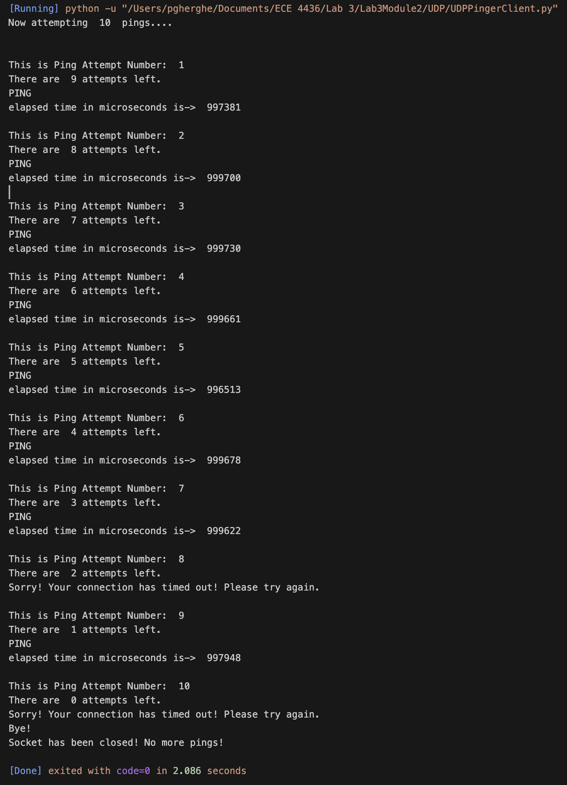
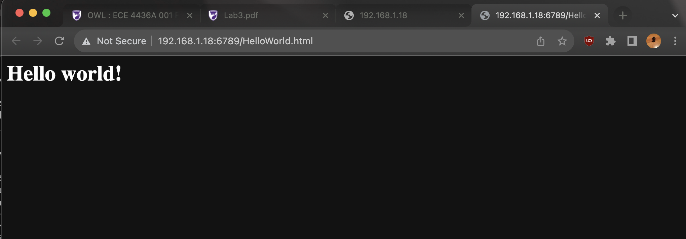
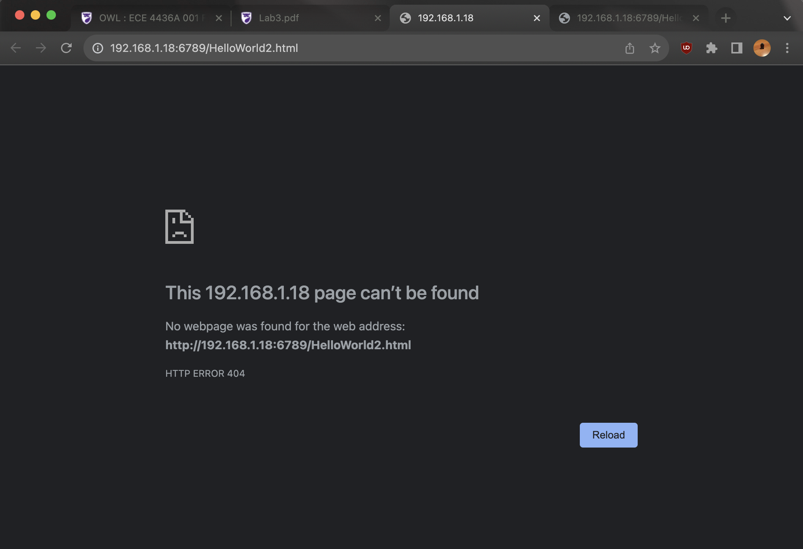

# UDP/TCP Communication Module

This repository contains the implementation and documentation for a module focused on demonstrating UDP and TCP communication protocols through two main components: a UDP Pinger server and a TCP Web server. This educational project helps illustrate the behavior and characteristics of both connectionless and connection-oriented communication.

## 📡 UDP Pinger Server

### Description

The UDP Pinger server simulates packet loss and provides functionality for measuring round-trip times (RTT) between the server and a client. It is designed to drop approximately 30% of the incoming packets randomly to mimic real-world data packet loss during UDP communication.

### Features

- **Packet Loss Simulation:** Randomly simulates the loss of incoming packets.
- **RTT Calculation:** Allows the client to measure and print the round-trip time for each packet.
- **Timeout Implementation:** Uses a timeout mechanism to handle lost packets and prevent indefinite waiting.

### Server Code Snippet

```python
import random
from socket import *
serverSocket = socket(AF_INET, SOCK_DGRAM)
serverSocket.bind(('', 12000))

while True:
    rand = random.randint(0, 10)
    message, address = serverSocket.recvfrom(1024)
    message = message.upper()
    if rand < 4:
        continue
    serverSocket.sendto(message, address)
```

### UDP Output Example

Here are some visual outputs from the UDP Pinger server simulation:

<p align="center">
    
</p>

## 🌐 TCP Web Server

### Description

The TCP Web Server handles HTTP requests one at a time, serving files directly from the server's file system or returning a "404 Not Found" error if the requested file is not present.

### Features

- **HTTP Request Handling:** Accepts and parses HTTP requests.
- **File Serving:** Retrieves and sends the requested file with proper HTTP header lines.
- **Error Handling:** Sends an HTTP "404 Not Found" message if the requested file does not exist.

### TCP Output Screenshots

HelloWorld.html Served

<p align="center">
    
</p>

File Not Found

<p align="center">
    
</p>

## 🔍 Conclusion

The UDP/TCP Communication Module provides practical experience with both UDP and TCP protocols, emphasizing the differences between connectionless and connection-oriented communications. This project showcases the challenges and strategies in network programming, particularly in handling reliability and data integrity.
